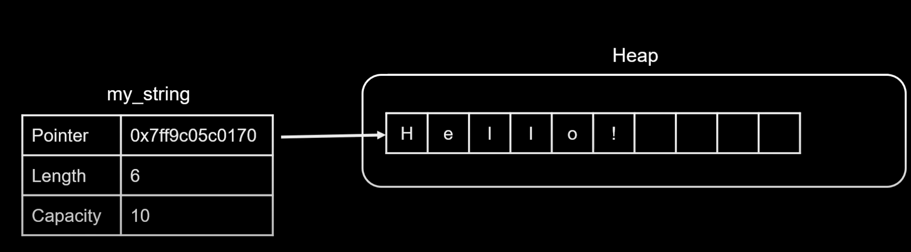
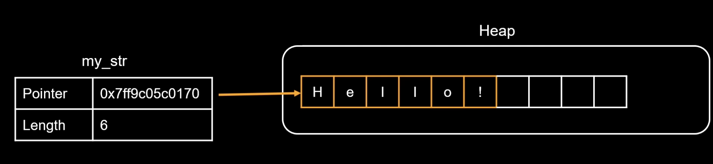

#### Safety

- No null terminator
- Immutable by default
- UTF-8 encoding.

### String

- Heap Allocated
- Ownable
- Growable
- UTF-8 encoded
- usefull when create/modify the strings
  
- This format helps in easier manipulation

### &str

- string slice
- view to String
- does't own the data
- not Growable
- access data in heap or in binary or in stack (rare but possible)
- Read/analyze strings
- command arguments, or searching for a substring
  

### Box<str>

- owned
- not Growable
- heap-allocated string size
- usefull when freeze a string to prevent furture modification. by dropping extra capicity info. in String type
- usecase in apis which return owned string which is not modified further or to save memory aggresivly to imp. prefromance

### Rc<str>

- shared
- Immutable string slice
- without cloning data
- only stored once in memory no clone is created while referencing

### Arc<str>

- atomic reference counted
- thread safe
- shared
- Immutable string slice
- usefull when you have to share a data with multiple threads without cloning data

### Cow<'a, str>

- Copy On Write
- used in functions that modifies a string other times it doesn't. Avoid memory allocation if no modification is neseccssery
- Use cases for `Cow<str>`:
  - API Design: When you want to provide a flexible API that can work with both borrowed and owned strings.
  - Caching: When you want to cache a potentially modified version of a string without always allocating.
  - Optimizing Allocations: In scenarios where you might need to modify a string, but often don't.
  - Serialization/Deserialization: Libraries like serde use Cow<str> to efficiently handle string data that may or may not need to be owned.
